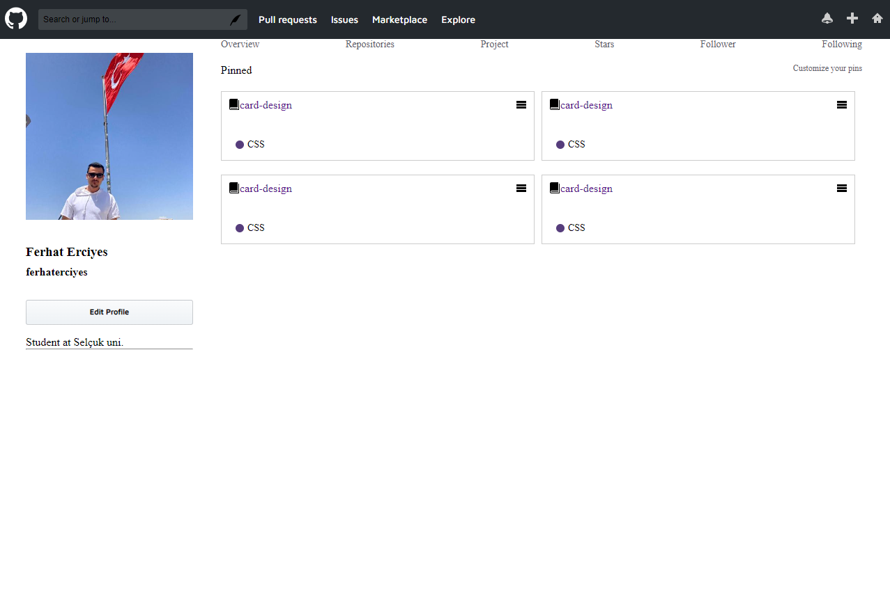

# GitHupScss
<h1> GitHup </h1>
Scss kullanılarak  daha düzenli bir şekilde basic bir proje tasarlandı,son olarak kullanılan yapılar import edilerek tek bir katman haline getirildi 

<h2>Kullanılan teknolojiler </h2>

HTML% , SCSS ve ile ileri aniasyon teknolojileri 

<h2>Ekran Gifi</h2>

